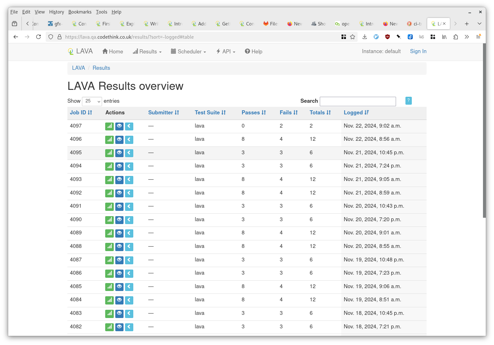

# Comparison of QA tools for operating systems

This article is about tools for testing operating systems. To fully test an operating system, we have to start by booting the OS on a device, and we run tests that control the machine as an end-user would -- for example, visually navigating a graphical interface and sending keyboard and mouse events to trigger actions. 

The same tools can be used for end-to-end testing of applications.

This comparison is divided into two types of QA tool: **test drivers** and **test orchestrators**.

The **test driver** runs a test suite on a **target device**. The test driver may be an all-in-one tool like os-autoinst, or it may be a custom script that you write yourself as part of the test suite. The test driver must run outside of the target device, as the target device will reboot between test runs.

The **orchestration** tool manages the state around testing. Information it may record includes:

  * Available **test suites** and how to run them.
  * Recorded **test jobs**, i.e. what happened this time when we tried to run a test suite.
  * **Assets** which are input and outputs from tests, for example the OS image we want to test.
  * Available **target devices**, which may be laptops, phones, development boards, etc.

QA **orchestration** tools might provide the following features:

  * Views of the recorded test jobs
  * Management of test jobs, e.g. manually triggering them, 
  * Management of target devices, e.g. adding and removing machines.
  * Authentication and authorization to see who can view and control the tests

We deal with these tools separately because you can mix-and-match them in your QA setup.

## Comparison of test drivers and helper tools

### Summary

[os-autoinst](https://github.com/os-autoinst/os-autoinst) is a test driver that integrates with the orchestration tool openQA. It includes helpers for visual navigation, keyboard and mouse control, and more.

It's released as a [container image](https://build.opensuse.org/package/show/devel:openQA/openQA_container_worker) (bundled with openQA worker), and is also [packaged in Debian/Ubuntu, Fedora and openSUSE](https://repology.org/project/os-autoinst/versions).

[vncdotool](https://github.com/sibson/vncdotool) is a helper tool you can call from scripts which can do visual navigation, keyboard and mouse control and more.

It's released as a [PyPI package](https://pypi.org/project/vncdotool/) and is [packaged in Debian/Ubuntu and Arch Linux](https://repology.org/project/vncdotool/versions).

### At a glance

|                         | os-autoinst      | vncdotool                     |
| ----------------------- |:---------------- | ----------------------------- |
| All-time committers     | 192              | 37                            |
| License                 | GPL-2.0-or-later | MIT                           |
| Implementation language | Perl             | Python                        |
| Lines of code           | ~22,000          | ~2400                         |
| Test language           | Perl, Python     | Any (via commandline), Python |

### Feature matrix

|                                        | os-autoinst               | vncdotool         |
| -------------------------------------- |:------------------------- | ----------------- |
| Audio capture and analysis             | Limited                   | No                |
| Command execution in system under test | Yes                       | No                |
| Control protocols                      | VNC, QEMU, serial, custom | VNC               |
| Keyboard control                       | Yes                       | Yes               |
| Mouse control                          | Yes                       | Yes               |
| Multitouch/gesture control             | No                        | No                |
| Power on/off/reboot                    | Yes                       | No                |
| Visual navigation (image recognition)  | Yes (with openCV)         | Yes (with Pillow) |

### Examples

Simple os-autoinst examples:

  * [os-autoinst-distri-example](https://github.com/os-autoinst/os-autoinst-distri-example)
  * The [minimal-test](https://gitlab.gnome.org/sthursfield/ssam_openqa/-/tree/main/examples/minimal-test?ref_type=heads) in ssam_openqa tool

Real-world os-autoinst examples are listed [here](https://github.com/os-autoinst/linux-qa/issues/1#issuecomment-2211159382.)

### Notes

vncdotool provides `vnclog` which can intercept a VNC session, capture keyboard and mouse events and generate a script to replay them.

## Test orchestration tools

### Summary

[ci-tron](https://gfx-ci.pages.freedesktop.org/ci-tron/index.html): Coordination tool to orchestrate and manage devices in a board farm.

[Gitlab CI](https://docs.gitlab.com/ee/ci/): Test orchestration system built into Gitlab. Tests are executed by [runners](https://docs.gitlab.com/runner/). A runner is a device running the `gitlab-runner` program and connected to the Gitlab server. There are several [executor](https://docs.gitlab.com/runner/executors/#selecting-the-executor) backends, some of which can 'autoscale'.

[LAVA](https://docs.lavasoftware.org/lava/index.html#): "Linaro Automation and Validation Architecture".

[openQA](http://open.qa/docs/): Orchestration tool with a web interface that closely integrates with the os-autoinst test driver. An openQA instance consists of the server and web UI, plus one or more static workers.

### Architecture and hardware requirements

ci-tron:

  * A gateway machine with two network interfaces, one connected to the internet and one connected to all the **target devices**. This machine runs the ci-tron container image. ([ref](https://gfx-ci.pages.freedesktop.org/ci-tron/docs/installation_and_development.html#requirements))
  
Gitlab CI:

  * A Gitlab instance. (This can be gitlab.com or a custom setup)
  * One or more Gitlab runners. There are various [executor](https://docs.gitlab.com/runner/executors/) options, including:
      * Shell, which can be used for gateway machines connected physically to **target devices**
      * Docker, which can spawn privileged containers that can run **virtualized target devices**

LAVA:

  * One server ("master")
  * One or more workers. Each worker can be connected to one or more **target devices**.

openQA:

  * One server ("web UI")
  * One or more workers. Each worker can be connected to a single **target device**.

### At a glance

|                         | ci-tron         | Gitlab CI | LAVA             | openQA           |
| ----------------------- | --------------- | --------- |:---------------- | ---------------- |
| All-time committers     | 16              | ~6,200    | 180              | 186              |
| License                 | MIT             | MIT       | GPL-2.0-or-later | GPL-2.0-or-later |
| Implementation language | Python, Ansible | Ruby      | Python           | Perl             |
| Lines of code           | ~17,000         | zillions | ~80,000          | ~54,000          |
| Configuration syntax    | YAML            | YAML      | YAML             | YAML or web UI   |

### Feature matrix

| Features                        | ci-tron              | Gitlab CI                   | LAVA                 | openQA                  |
|:------------------------------- | -------------------- | --------------------------- | -------------------- | ----------------------- |
| API                             | HTTP + CLI           | HTTP + CLI                  | HTTP + CLI           | HTTP + CLI              |
| Asset tracking                  | No                   | Yes                         | Yes                  | Yes                     |
| Hardware control helpers        | For GPU testing only | No                          | Yes                  | Minimal                 |
| Management UI                   | Yes (TUI)            | Yes (web UI)                | Yes (web UI)         | Yes (web UI)            |
| Test editing UI                 | No                   | No                          | No                   | Partial (Needle editor) |
| Access management               | No                   | LDAP, OAuth, local accounts | LDAP, local accounts | OpenID, OAuth2          |
| Virtual device support          | [Yes (virtual DUTs)] | DIY                         | ?                    | Yes (QEMU machine type) |
| Distribute jobs between workers | Yes                  | Yes                         | Yes                  | Yes                     |

[Yes (virtual DUTs)]: https://gfx-ci.pages.freedesktop.org/ci-tron/docs/installation_and_development.html#spawning-virtual-duts

### Screenshots

#### ci-tron

#### Gitlab CI

#### LAVA

#### openQA

## Hybrid approaches

It's possible to combine some of the above tools.

One example: the GNOME project uses Gitlab CI to trigger tests. The Gitlab CI job starts an openQA worker inside the test container, and registers that with the web UI. It then calls the openQA server to run a test job inside the same container. Thus Gitlab CI handles the allocation of workers, while test results are still visible in the openQA web UI.

## See also

There are more ways to schedule test operations. [Buildbot](https://www.buildbot.net/) is one. [Fuego](http://fuegotest.org/) (based on Jenkins) is another. [Zuul](https://zuul-ci.org/) is another.

